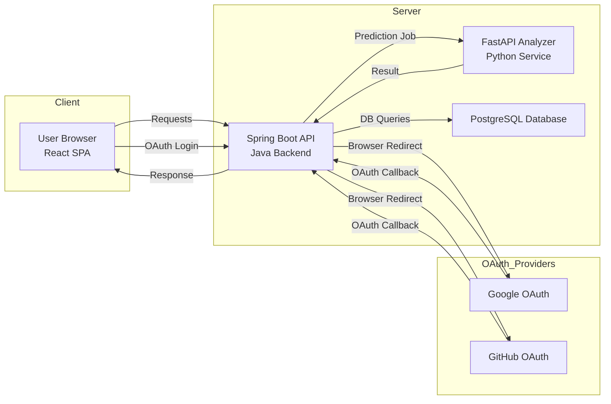

# MLSuite


**MLSuite** is an open-source web platform for managing machine learning models and running live predictions with them. Its purpose is to simplify the **deployment, testing, and evaluation** of ML models by providing an end-to-end workflow: from model upload and input **signature** definition to executing predictions and collecting feedback on results. With MLSuite, data scientists and engineers can turn any trained ML model into an interactive web application for experimentation, without writing custom interfaces or deployment code. The system ensures **reproducibility and traceability** for all experiments, making it easy to track which model (and input schema) produced each result.

In practical terms, MLSuite lets you upload a machine learning model (e.g. a scikit-learn model), automatically generates a typed input form for that model, and allows you to input data and get predictions through a friendly UI. All predictions, along with their inputs and outcomes, are stored in a database, enabling you to review model performance, mark predictions as correct or incorrect, and even export the collected data for retraining. The platform streamlines the typical model deployment and model validation process into a single cohesive application.

## Getting Started (Production Deployment with Docker Compose)

**Follow these steps to deploy MLSuite using Docker Compose.** This guide assumes minimal experience with Docker and OAuth setup, and will walk you through the process in detail.

1. **Prerequisites**: Install **Docker** and **Docker Compose** on your server or local machine. Verify that running docker --version and docker compose version works without errors.

2. **Clone the Repository**: Download the MLSuite source code from GitHub:

```bash
git clone https://github.com/UlloaSP/mlsuite.git
cd mlsuite
```

This repository contains a pre-configured docker-compose.yml that defines all required services (frontend, backend, ML analyzer, database).

3. OAuth Credentials Setup: MLSuite uses OAuth2 for user authentication (Google and GitHub login). You will need to register OAuth applications to obtain Client IDs and Secrets:

- Google OAuth: Go to the Google Cloud Console and create a new OAuth 2.0 client ID (of type "Web application"). Add an authorized redirect URI pointing to your deployment URL + /login/oauth2/code/google (for example, http://localhost:8080/login/oauth2/code/google for local deployment). Note the generated Client ID and Client Secret.

- GitHub OAuth: On GitHub, go to Settings > Developer settings > OAuth Apps and register a new application. Use http://localhost:8080/login/oauth2/code/github as the authorization callback URL (or your production domain accordingly). After registration, you’ll get a Client ID and Client Secret.

Why this step? – MLSuite delegates user authentication to Google/GitHub, so users can log in securely. The OAuth credentials enable MLSuite’s backend to redirect users for login and then accept the callback with a token.

4. Configure Environment Variables: Open the .env.example (or create a .env) file in the project and add your OAuth credentials and any other necessary settings. At minimum, set:

```env
GOOGLE_CLIENT_ID=<your Google OAuth client id>
GOOGLE_CLIENT_SECRET=<your Google OAuth client secret>
GITHUB_CLIENT_ID=<your GitHub OAuth client id>
GITHUB_CLIENT_SECRET=<your GitHub OAuth client secret>
```

You can also adjust other settings (like database password, etc.) here. The Docker Compose file will load these values and pass them to the containers. If you prefer, you can edit the docker-compose.yml to directly insert these env vars under the backend service.

5. Launch the Application: Run the following command to build and start all services:

```bash
docker compose -f docker-compose.prod.yml up --build -d
```

This will spin up all components of MLSuite in separate containers. The first run may take a few minutes to download base images and build the code. Subsequent starts will be faster.

6. Access MLSuite: Once the containers are running, open your web browser and go to https://localhost:5173 (or the appropriate host/port if deploying to a server). You should see the MLSuite web interface. Click “Login” to sign in via Google or GitHub (depending on how you configured OAuth). Upon first login, your user account will be created in the system automatically.

7. Use MLSuite: After logging in, you can start uploading models and running predictions (see the Functionality section below for an overview of features). By default, the React frontend will be served on port 5173. If you need to change ports or other settings, adjust the environment variables or compose file accordingly.

Troubleshooting: If some containers fail to start, run docker compose logs -f to inspect the logs of each service. Common issues often involve misconfigured environment variables (e.g. incorrect OAuth secrets or database connection issues). Make sure the OAuth redirect URLs exactly match your deployment address. If running on a remote server, update the OAuth app settings to use your server’s URL instead of localhost.

## Functionality

MLSuite provides a rich set of features to manage the entire lifecycle of ML model experimentation. Here are the core features and what you can do with them:

- Model Uploading: Users can upload trained machine learning models to the platform. MLSuite currently supports models serialized in Python (e.g. scikit-learn .pkl or .joblib files), and the system is designed to be extensible to other frameworks. When uploading a model, you can also provide a sample dataset (CSV or similar) that was used to train the model. This helps the system infer the model’s expected input schema.

- Automatic Signature Creation: Upon model upload, MLSuite automatically generates an input signature – a schema describing the model’s input fields (feature names, data types, valid ranges, categories, etc.) and expected output. This is powered by the MLSchema library, which analyzes the provided sample dataset or model interface to propose a JSON schema for inputs and outputs. The signature acts as a contract between the model and the UI.

- Custom Signature Editing & Versioning: Users can review and refine the generated input signature or create new ones. MLSuite provides a built-in code editor with live validation for modifying the JSON schema. You can adjust field constraints, default values, accepted ranges, or add descriptive labels and help text. Each model can have multiple signatures (schemas) and each signature is versioned (using semantic versioning, e.g. v1.0.0). This allows you to evolve the input format over time (for example, if a new version of the model requires different inputs) while keeping old versions for reproducibility.

- Dynamic Form Generation: Thanks to the MLForm library, every signature can be rendered as a web form automatically. In the UI, you can toggle between a raw JSON editor for inputs or a user-friendly form. The form adapts to the signature – for example, if a field is numeric with a certain range, the form will use a bounded number picker; if a field is categorical, you’ll get a dropdown menu, etc. This means non-technical users can fill in model inputs without worrying about format or validation, as the form enforces the correct types and required fields.

- Prediction Execution: With a model uploaded and a signature selected, you can execute predictions directly from the MLSuite interface. Simply fill out the input form (or JSON) and submit – the system will send the input to the backend, which in turn calls the ML Analyzer service (FastAPI) to load the model and compute the prediction. The prediction result is then displayed in the UI, aligned with the output schema. MLSuite supports real-time inference on single inputs through this interface, essentially providing a quick way to test the model with arbitrary data.

- Prediction History & Traceability: For each model and each signature, MLSuite maintains a history of all predictions made. This includes the input data, the model’s output, the timestamp, and the exact versions of the model and signature used. The history is visible in the UI (as a list or table of past predictions) so you can review what predictions were made, when, and by whom. This traceability ensures that you can always trace a result back to the specific model version and input schema that produced it, which is crucial for reproducible experiments and auditing model behavior over time.

- Feedback Loop (Human-in-the-Loop): MLSuite incorporates a feedback mechanism to close the ML lifecycle loop. After running a prediction, users (especially domain experts or model testers) can mark the prediction as correct or incorrect. If a prediction is marked incorrect, the user can provide the actual ground truth value or correction. For example, if the model predicted “no disease” but the expert knows the true outcome was “disease”, the expert can flag it and input the correct result. These validations are stored alongside the prediction in the history, labeling each prediction as accepted, rejected/incorrect, or pending review. This human-in-the-loop feedback helps in evaluating model performance and can generate new labeled data.

- Export to CSV (Data Export): All your prediction data – inputs, model outputs, and any feedback (true values for incorrect predictions) – can be exported as a CSV file. This feature allows you to easily take the accumulated prediction records and use them for downstream tasks. For example, you might export the data to create a new training dataset (including the model’s mistakes with corrections) for retraining or improving the model. The export function lets you filter by status (e.g. only failed predictions with corrections, only completed predictions, etc.) and produces a CSV with one row per prediction, including all input fields, the model’s output, the user-provided correct output (if any), timestamps, and identifiers for the model/signature version used.

- User Management & Security: The platform is secured via OAuth2 authentication. Only authenticated users can access the system, and each user’s models and prediction data are kept separate (each model is associated with the user who uploaded it). MLSuite uses industry-standard OAuth (Google, GitHub) for login, so it never stores raw passwords. This also means you can easily control who has access by managing authorized accounts via your OAuth providers. Session management is handled server-side via Spring Security, and API routes enforce proper authorization checks.

In summary, MLSuite offers a full suite of functionalities to treat a machine learning model as a product: upload and manage models, define input contracts, interact with models through autogenerated UIs, validate their outputs, and iterate with new data – all through a unified web interface.

## Architecture

MLSuite’s architecture is modular and follows a microservices-inspired design. The system is composed of several interacting components, each with a specific role. At a high level, the architecture consists of:

- Frontend – React SPA (with MLForm): The user interface is a single-page application built with React and TypeScript. It uses the MLForm library to dynamically render forms from JSON schemas (signatures). This frontend provides all the visuals: model catalog, forms for input, tables for prediction history, etc. When a user interacts (e.g. submitting a prediction or uploading a model), the React app calls the backend REST API. The UI is protected by login – unauthenticated users are redirected to the OAuth2 login flow.

- Backend API – Spring Boot (Java): The core of MLSuite is a Spring Boot application that serves as the API Gateway and orchestrator. This backend exposes RESTful endpoints for all operations (model management, signature CRUD, running a prediction, fetching history, etc.). It handles authentication via Spring Security with OAuth2 (delegating to Google/GitHub and maintaining user sessions). The backend contains the business logic to validate inputs against the schema and ensures that each prediction request is routed to the correct model and signature. It also interacts with the database to store/retrieve models, signatures, users, and predictions. In essence, the Spring Boot API coordinates the other parts: it receives requests from the frontend, checks permissions and data validity, calls the ML analyzer service for predictions, and returns results back to the frontend.

- Analyzer Service – FastAPI (Python): The analyzer is a Python microservice (using FastAPI) responsible for the heavy lifting of loading ML models and executing predictions. When a prediction request comes in, the Spring Boot backend forwards the request to this service (over HTTPS). The FastAPI analyzer takes the model,  and runs the model’s predict method on the input data. It uses the MLSchema library to ensure the input conforms to the expected schema (for extra safety) and then returns the prediction result (and any metadata) back to the Java backend. By isolating this functionality in a Python service, MLSuite can leverage Python’s rich ML ecosystem (scikit-learn, pandas, etc.) while keeping the main API in Java. This design also paves the way to support multiple backend frameworks in the future (for example, separate services for R models, TensorFlow/PyTorch models, etc., each with their own runtime). In the current implementation, the analyzer supports scikit-learn models; the architecture is designed to be extensible via a plugin mechanism to add more.

- Database – PostgreSQL: All persistent data is stored in a PostgreSQL relational database. The data schema includes tables for Users, Models, Signatures, and Predictions (along with related entities). Whenever a user uploads a model, a record is created in the Models table (with metadata like name, owner, file path, etc.). Each signature is stored (likely as a JSON schema or as structured fields) linked to its model and with version info. Predictions are logged with a reference to the model & signature used, a blob of input data, the output result, status (pending/validated), timestamps, and optional feedback annotation. Using a SQL database ensures strong consistency and the ability to write complex queries (for example, to find all predictions of a certain model version that were marked incorrect, etc.). The Spring Boot backend uses an ORM (or JDBC) to interact with PostgreSQL.

All components are containerized and defined in the Docker Compose configuration, which makes it easy to deploy the whole stack together. Here’s a simplified overview of how these pieces interact:



Communication flow: When a user logs in, the React app redirects to the Spring Boot API’s OAuth endpoint, which then redirects the user to Google or GitHub. After authentication, the OAuth provider sends the user back with a token, and the Spring backend creates a session. Now authenticated, the user can use the app. When the user uploads a model or creates a signature, the frontend sends a request to the Spring Boot API, which stores the model (possibly as a file on disk or object in the database) and records metadata in PostgreSQL. If a sample dataset is provided, the Spring backend might call the FastAPI service (or use an internal routine) to analyze it and produce an initial schema. When the user wants to run a prediction, the frontend sends the input data to the Spring API, which validates it against the selected signature, then calls the FastAPI analyzer with the model and input. The analyzer takes the model and computes the prediction. The result is sent back to the Spring API, which stores the new Prediction record in PostgreSQL and forwards the result to the frontend to display. If the user provides feedback on that prediction, another API call updates the record in the DB. This separation of concerns (UI, API, ML processing, storage) makes the system scalable and easier to maintain.

## Contributing

First off, thank you for considering contributing to MLSuite! We welcome contributions of all kinds – from bug fixes and documentation improvements to new features and integrations. Since this project is under active development, your ideas and patches can have a big impact.

If you’d like to contribute, please follow these steps:

1. Fork the Repository: Click the “Fork” button at the top of the MLSuite GitHub page to create your own copy of the repo.

2. Clone Your Fork: Download your fork to your local system:

```bash
git clone https://github.com/<your-username>/mlsuite.git
cd mlsuite
```

Add the main repository as an upstream remote to keep your fork up to date:

```bash
git remote add upstream https://github.com/UlloaSP/mlsuite.git
```
3. Create a Branch: Before making changes, create a new branch for your feature or bugfix:

```bash 
git checkout -b my-feature-branch
```

Use a descriptive name for your branch (e.g. fix-login-bug or add-confusion-matrix-export).

4. Make Your Changes: Open up the project in your IDE and make the changes you intend. If you are adding a new feature, try to update or add relevant tests (if available) and documentation. Ensure that the code follows the project’s style (formatting and linting) – the project may have configuration for tools like ESLint/Prettier for the frontend or Checkstyle/Spotless for the backend.

5. Run and Test: It’s a good idea to run the test suite and build the project before submitting. For example, you might run the backend tests with Maven/Gradle and the frontend build with npm, to ensure nothing is broken. You can also use the Docker Compose setup to spin up the system with your changes and do some manual testing in the browser.

6. Commit and Push: Commit your changes with a clear commit message:

```bash
git add .
git commit -m "Add feature X (brief explanation of what and why)"
git push origin my-feature-branch
```

7. Open a Pull Request: Go to your fork on GitHub and you should see a prompt to open a Pull Request (PR) from your recently pushed branch. Click that, provide a descriptive title and detailed description for your PR (explain what you changed and why, and mention any related issue numbers). Mark the PR as ready for review.

8. Discuss and Iterate: A project maintainer will review your PR. There might be feedback or requests for changes – this is normal. Iterate by pushing additional commits to your branch, which will automatically update the PR. Once everything looks good and tests pass, your PR will be merged into the main codebase!

Tips for contributing:

- For significant changes or new features, it’s often a good idea to open an issue or discussion first to ask if the change aligns with the project’s goals. This can save time and ensure your work is likely to be accepted.

- Make sure to update documentation or comments if your change affects how users or developers would interact with the system.

- If you find a bug and fix it, consider adding a test case that would have caught that bug to prevent regressions in the future.

- Be respectful and patient during the review process – all contributors and maintainers share the goal of improving MLSuite.

By contributing to MLSuite, you agree that your contributions will be licensed under the MIT License (this is the same license the project uses).

## Issues & Support

Do you have a bug report, a feature request, or need help with using MLSuite? We’d love to hear from you. Here’s how you can reach out:

- Bug Reports: If you encounter a problem or something isn’t working as expected, please open an issue on the GitHub repository. Include as much detail as possible: steps to reproduce, environment (OS, browser, etc.), and any relevant logs or screenshots. This will help us diagnose and fix the issue faster.

- Feature Requests: Have an idea for a new feature or an improvement to existing features? Feel free to create an issue with the Feature Request template (if available) or label. Describe the feature, your use-case, and any thoughts on how it might be implemented. Discussion is encouraged – we welcome feedback and new ideas!

- Questions & Help: If you need assistance with deploying or using MLSuite, you can also use the GitHub issues to ask questions (label them as question/discussion). We (the maintainers) or the community can then help you out. Please make sure to check the project’s README and documentation first, in case the answer is already there.

For quick help or informal discussion, you might find a GitHub Discussions forum or a chat channel listed in our repo (check the README or GitHub project page for links). If available, those are great places to ask general questions, share use cases, or get guidance.

We aim to be responsive and helpful, but please understand that MLSuite is an open-source project. Maintainership is a best-effort basis. If your issue doesn’t get an immediate response, we may be busy – we will get to it as soon as we can. Community involvement is also welcome: if you see someone else’s question that you know how to answer, please jump in!

## License

This project is licensed under the MIT License. This means you are free to use, modify, and distribute MLSuite in your own projects, whether open-source or proprietary, as long as you include the license notice. (See the LICENSE file for the full text.)

> [!NOTE] 
> MLSuite is a research-driven project and is under active development. You may encounter rough edges or incomplete features as we continue to improve the platform. We’re actively working on adding support for more model types and frameworks, refining the UI/UX, and hardening the system for production use. Contributions and feedback are very welcome! The goal is to build a robust community-driven suite for machine learning deployment and experimentation. Stay tuned for updates, and happy model serving!

