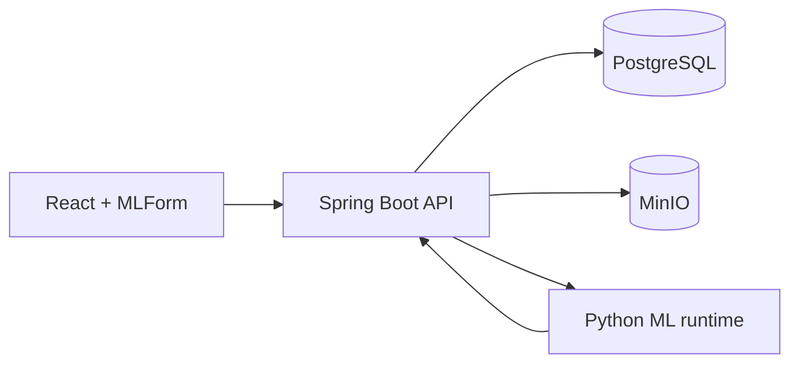

# MLSuite

MLSuite turns trained machine-learning models into reproducible, reviewable applications.

Upload a model, build a typed schema for its inputs and outputs, run predictions through an automatically generated interface, collect human feedback, and export the resulting data for evaluation or retraining.

The stack combines a React frontend, a Spring Boot API, and a Python ML runtime. PostgreSQL stores application state, MinIO stores artifacts, and Docker Compose runs the complete system.

## “Wait, what are you selling me?”

Nothing.

We built MLSuite because testing a model with real users usually means rebuilding the same infrastructure: artifact storage, input validation, custom forms, prediction history, permissions, review workflows, and exports.

MLSuite puts that loop in one open-source product. The goal is not merely to serve a `predict()` endpoint. The goal is to preserve exactly which model and schema produced a result, let people inspect and correct it, and turn those corrections into useful data.

If MLSuite goes in the wrong direction, the full stack is here for you to inspect, change, and fork.

## What can it do?

- Store and manage trained model artifacts.
- Analyze model inputs and generate versioned schemas.
- Render schemas as validated forms with MLForm.
- Run individual and bulk predictions.
- Preserve prediction history with exact model and schema identity.
- Collect reviews, corrections, questionnaires, and explanation feedback.
- Extend reports and fields through plugins.
- Export inputs, outputs, and feedback for downstream work.
- Manage organizations, teams, roles, invitations, and workspace permissions.
- Monitor the local Compose stack through the operations service.

### Model artifacts

Upload `.joblib` estimators or self-contained `.onnx` models for tabular classification and regression. ONNX models need numeric, two-dimensional inputs with a fixed feature count. Classifiers must expose class labels and probabilities; regressors must return one value per row. Optional pandas DataFrames for schema generation remain `.joblib` files. Crystal Tree explanations apply to supported decision-tree estimators only.

## Installation

> [!WARNING]
> MLSuite is early software. Expect rough edges and breaking changes.

You need Git and Docker with Docker Compose.

### Clone and configure

```bash
git clone https://github.com/UlloaSP/mlsuite.git
cd mlsuite
cp .env.example .env
```

On Windows PowerShell:

```powershell
git clone https://github.com/UlloaSP/mlsuite.git
Set-Location mlsuite
Copy-Item .env.example .env
```

Open `.env` and provide independent values for every blank secret, especially:

- `DB_PASS`
- `STORAGE_SECRET_KEY`
- `OPS_AGENT_SHARED_SECRET`
- `REVIEW_LINK_SECRET`
- `MLSUITE_SUPERADMIN_PASSWORD`

Keep `.env` private. Commit only sanitized defaults to `.env.example`.

### Start the development stack

```bash
docker compose -f docker-compose.dev.yml up --build -d
```

Then open [http://localhost:5173](http://localhost:5173) and sign in with the superadmin account configured in `.env`.

Inspect service state or logs with:

```bash
docker compose -f docker-compose.dev.yml ps
docker compose -f docker-compose.dev.yml logs -f
```

Stop the stack with:

```bash
docker compose -f docker-compose.dev.yml down
```

### Production images

Successful publications from `main` create immutable `build-<commit>` releases with digest-pinned images and a Compose override. MLSuite does not update `latest`.

Read [release selection and verification](./docs/RELEASES.md) before using published images. The release bundle supplies verified artifacts; deployment, migration, backup, readiness, promotion, and rollback remain operator responsibilities.

## Some notes

We are early in this project. Expect bugs.

MLSuite is research-driven and currently centered on Python model runtimes. The contracts are designed to support more model types without making the UI or API depend on one framework.

Contributions are welcome. Report bugs through [Issues](https://github.com/UlloaSP/mlsuite/issues), propose features in [Ideas](https://github.com/UlloaSP/mlsuite/discussions/categories/ideas), and ask usage questions in [Q&A](https://github.com/UlloaSP/mlsuite/discussions/categories/q-a). For large features or contract changes, agree on direction before implementation.

## Documentation

Project documentation lives in [docs/](./docs):

- [Immutable releases](./docs/RELEASES.md)
- [CI and repository protection](./.github/CI.md)
- [Contributing](./CONTRIBUTING.md)
- [Security policy](./SECURITY.md)
- [Code of Conduct](./CODE_OF_CONDUCT.md)

Working on the frontend? Read [frontend architecture](./frontend/ARCHITECTURE.md) and the [design system](./DESIGN.md).

## If you REALLY want to contribute still... read this first

Read [CONTRIBUTING.md](./CONTRIBUTING.md) and [AGENTS.md](./AGENTS.md) before changing code.

### Frontend

The frontend uses [Vite+](https://viteplus.dev/) through the global `vp` command:

```bash
cd frontend
vp i
vp check
vp test
```

### Spring API

The API requires Java 25 and Maven:

```bash
cd api
mvn test
```

### Python runtime

The runtime requires Python 3.14+ and `uv`:

```bash
cd backend
uv sync --extra dev
uv run pytest tests/test_runtime_api.py
```

Use the integrated Compose stack when a change crosses service boundaries. Run focused checks for the component you changed before broadening verification.

## How it fits together


```mermaid
flowchart LR
    UI[React + MLForm] --> API[Spring Boot API]
    API --> DB[(PostgreSQL)]
    API --> STORE[(MinIO)]
    API --> ML[Python ML runtime]
    ML --> API
```

The browser sends authenticated requests to Spring. Spring enforces workspace permissions, stores durable state, and delegates artifact analysis or prediction to Python. Results return through Spring so model, schema, input, output, and feedback identities remain traceable.

## License

MLSuite is available under the [MIT License](./LICENSE).
