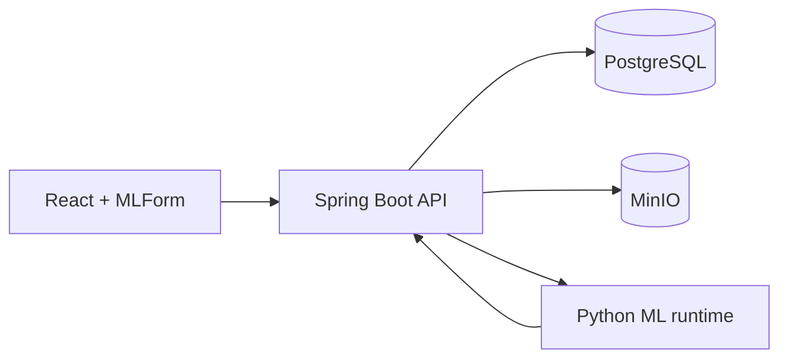

# MLSuite

MLSuite turns trained machine-learning models into reproducible, reviewable applications.

Upload a model, build a typed schema for its inputs and outputs, run predictions through an automatically generated interface, collect human feedback, and export the resulting data for evaluation or retraining.

The stack combines a React frontend, a Spring Boot API, and a Python ML runtime. PostgreSQL stores application state, MinIO stores artifacts, and Docker Compose runs the complete system.

## “Wait, what are you selling me?”

Nothing.

We built MLSuite because testing a model with real users usually means rebuilding the same infrastructure: artifact storage, input validation, custom forms, prediction history, permissions, review workflows, and exports.

MLSuite puts that loop in one open-source product. The goal is not merely to serve a `predict()` endpoint. The goal is to preserve exactly which model and schema produced a result, let people inspect and correct it, and turn those corrections into useful data.

If MLSuite goes in the wrong direction, the full stack is here for you to inspect, change, and fork.

## What can it do?

- Store and manage trained model artifacts.
- Analyze model inputs and generate versioned schemas.
- Render schemas as validated forms with MLForm.
- Run individual and bulk predictions.
- Preserve prediction history with exact model and schema identity.
- Collect reviews, corrections, questionnaires, and explanation feedback.
- Extend reports and fields through plugins.
- Export inputs, outputs, and feedback for downstream work.
- Manage organizations, teams, roles, invitations, and workspace permissions.
- Monitor the local Compose stack through the operations service.

### Model artifacts

Upload `.joblib` estimators or self-contained `.onnx` models for tabular classification and regression. ONNX models need numeric, two-dimensional inputs with a fixed feature count. Classifiers must expose class labels and probabilities; regressors must return one value per row. Optional pandas DataFrames for schema generation remain `.joblib` files. Crystal Tree explanations apply to supported decision-tree estimators only.

## Installation

> [!WARNING]
> MLSuite is early software. Expect rough edges and breaking changes.

You need Git and Docker with Docker Compose.

### Clone and configure

```bash
git clone https://github.com/UlloaSP/mlsuite.git
cd mlsuite
cp .env.example .env
```

On Windows PowerShell:

```powershell
git clone https://github.com/UlloaSP/mlsuite.git
Set-Location mlsuite
Copy-Item .env.example .env
```

Open `.env` and provide independent values for every blank secret, especially:

- `DB_PASS`
- `STORAGE_SECRET_KEY`
- `OPS_AGENT_SHARED_SECRET`
- `REVIEW_LINK_SECRET`
- `MLSUITE_SUPERADMIN_PASSWORD`

Keep `.env` private. Commit only sanitized defaults to `.env.example`.

### Start the development stack

```bash
docker compose -f docker-compose.yml -f docker-compose.dev.yml up --build -d
```

`docker-compose.yml` is the single operational topology. The development override
only builds local application images; the production override only selects published
images. CI compares their fully rendered models and rejects any other drift. The
production cutover records the base, production and digest-pinned release files in
`OPS_AGENT_COMPOSE_FILES` so operational restarts use the same release.

An old disposable development volume can be recreated with `docker compose -f
docker-compose.yml -f docker-compose.dev.yml down -v`. To preserve an existing pre-Flyway development
database, audit it against the baseline first and set
`FLYWAY_BASELINE_ON_MIGRATE=true` for exactly one startup; return it to `false`
immediately afterwards.

Then open [http://localhost:5173](http://localhost:5173) and sign in with the superadmin account configured in `.env`.

Inspect service state or logs with:

```bash
docker compose -f docker-compose.yml -f docker-compose.dev.yml ps
docker compose -f docker-compose.yml -f docker-compose.dev.yml logs -f
```

Stop the stack with:

```bash
docker compose -f docker-compose.yml -f docker-compose.dev.yml down
```

### Production images

Successful publications from `main` create immutable `build-<commit>` releases with digest-pinned images and a Compose override. MLSuite does not update `latest`.

Read [release selection and verification](./docs/RELEASES.md) before using published images. The release bundle supplies verified artifacts; deployment, migration, backup, readiness, promotion, and rollback remain operator responsibilities.

### Production database and artifact rollout

For a real cutover, run the repeatable, gated operator wizard from the repository
root: `./scripts/production-cutover.sh`. It creates coordinated backups, requires
an isolated restore rehearsal, runs both migrations, checks readiness, and records
the rollback prerequisites. Review the procedure before running it; it changes the
configured production environment only after explicit confirmations.

The initial supported on-premise topology is explicitly `local-single-disk`. The
wizard creates a coordinated PostgreSQL plus MinIO recovery point, checksums it,
restores it in an isolated environment, and requires an explicit acknowledgement
that physical disk loss is not covered. These local backups protect against a bad
deployment or logical deletion; they are not PITR or disaster recovery. The
documented initial objective is a 24-hour logical-recovery RPO and an 8-hour RTO.

Run the same coordinated backup outside a release with:

```bash
ENV_FILE=.env ./scripts/create-local-backup.sh
```

Schedule it once per day from the host. The command pauses the frontend and API,
dumps PostgreSQL, takes a cold archive of MinIO that preserves version IDs, verifies
checksums, applies `LOCAL_BACKUP_RETENTION_COUNT`, checks the remaining disk space,
and restarts only application services that were running. Keep at least 15% free
with `LOCAL_BACKUP_MIN_FREE_PERCENT`. Backups live under `LOCAL_BACKUP_ROOT`, outside
the Docker data volumes but currently on the same physical disk. Before stopping
writes, the command requires conservative headroom for both the archive and the
isolated restore rehearsal: roughly 2.5 times the live PostgreSQL plus MinIO data,
in addition to the configured free-space reserve.

MLSuite uses Flyway as the only schema owner. Hibernate validates the result and
never creates or updates production tables. `docker-compose.yml` contains the
shared topology and `docker-compose.prod.yml` supplies published images; together
they run the same immutable API image in a one-shot `db-migrate` service before the
API is allowed to start.

Before the first Flyway-managed release:

1. Stop the frontend and API so PostgreSQL and MinIO are captured at one
   write-consistent point.
2. Create the coordinated local PostgreSQL and MinIO backup. The cold MinIO archive
   preserves object versions, delete markers, and version IDs that PostgreSQL
   references. Keep the MinIO image pinned when restoring it. Until another physical
   device exists, record disk or host loss as an accepted, unrecoverable risk.
3. Enable and verify bucket versioning. Do not configure lifecycle expiry inside
   the rollback window.
4. Compare the existing schema with `api/src/main/resources/db/migration/V1__baseline.sql`.
5. If and only if it represents that schema, explicitly baseline and migrate it:

```bash
docker compose --env-file .env -f docker-compose.yml -f docker-compose.prod.yml \
  run --rm \
  -e FLYWAY_BASELINE_ON_MIGRATE=true \
  -e FLYWAY_BASELINE_VERSION=1 \
  db-migrate
```

Never leave `FLYWAY_BASELINE_ON_MIGRATE` enabled. An empty installation
does not need a baseline; run `db-migrate` normally. Compose provisions three
roles idempotently: `DB_ADMIN_USER` owns the PostgreSQL service,
`DB_MIGRATION_USER` owns DDL and Flyway objects, and `DB_USER` receives only the
DML privileges needed by the application. Use distinct credentials in
production. On an externally managed database, create equivalent roles before
running Compose. For a volume created by an older MLSuite Compose, set
`DB_LEGACY_OWNER` and `DB_LEGACY_PASS` to its original `DB_USER` credentials;
the provisioner transfers table and sequence ownership before Flyway runs. PostgreSQL
cannot demote its bootstrap superuser, so the provisioner revokes that legacy role's
login after the new administrator is verified. The migration role must also be allowed to install `pg_trgm`;
alternatively, have a database administrator install that extension first.

After the schema migration and before artifact cutover, inspect status and run
the resumable backfill:

```bash
docker compose --env-file .env -f docker-compose.yml -f docker-compose.prod.yml \
  --profile operations run --rm \
  -e ARTIFACT_MIGRATION_COMMAND=status artifact-migrate

docker compose --env-file .env -f docker-compose.yml -f docker-compose.prod.yml \
  --profile operations run --rm \
  -e ARTIFACT_MIGRATION_COMMAND=migrate artifact-migrate

docker compose --env-file .env -f docker-compose.yml -f docker-compose.prod.yml \
  --profile operations run --rm \
  -e ARTIFACT_MIGRATION_COMMAND=verify artifact-migrate
```

After correcting an operational cause, reset exhausted rows with
`ARTIFACT_MIGRATION_COMMAND=retry-failed` and run `migrate` again. Stopping the
job is safe; expired `RUNNING` leases are reclaimed on the next execution.

The job claims rows with `FOR UPDATE SKIP LOCKED`, records attempts and failures,
uploads to immutable model/hash keys, reads each upload back, and compares its
SHA-256 before marking it verified. It never clears `model_file`. Keep
`STORAGE_RETAIN_INLINE_COPY=true` for this release so the previous application
can still read every model during the rollback window.

Production promotion gates are:

- `db-migrate` completed and Flyway validation has no drift;
- artifact `status` reports no `FAILED`, `RUNNING`, `INLINE_ONLY`, or
  `UNVERIFIED` rows before declaring the backfill complete;
- artifact `verify` succeeds with no missing, truncated, or hash-mismatched object;
- `/actuator/health/readiness` is healthy on the canary API;
- a PostgreSQL plus MinIO restore has been exercised in an isolated environment.

The API supports concurrent clients through one transaction per request, database
constraints as the final authority, and optimistic versioning on models. Two
clients changing the same model cannot silently overwrite each other: the stale
request receives `409 Conflict`. Hikari bounds database concurrency with
`DB_POOL_MAX_SIZE`, `DB_POOL_MIN_IDLE`, and `DB_POOL_CONNECTION_TIMEOUT_MS`;
size the pool from the PostgreSQL connection budget, leaving capacity for the
migration job and operations rather than matching it to the HTTP thread count.
Monitor `storageDeletionQueue` on `/actuator/info`; alert on any `failed` row or
on a `pending` count that grows continuously. Cleanup workers use database
leases, so several API instances process disjoint tasks and an expired worker
cannot complete or fail work reclaimed by another instance.

`MODEL_MUTATIONS_REQUIRE_VERSION=false` is available only for a controlled
compatibility window before production promotion, allowing an already-open older
frontend to mutate models without the new parameter. The production cutover requires
`true`: old cached clients must refresh, missing versions receive `428 Precondition
Required`, and mismatched versions receive `409 Conflict`. New clients always send
the version and therefore retain stale-write protection.

Persistence is abstracted by capability, not by a generic database wrapper.
Spring Data repository interfaces isolate aggregate persistence, while
`ArtifactMigrationQueue` hides the PostgreSQL-specific claiming implementation.
`StorageDeletionWorkQueue` provides the same boundary for asynchronous cleanup.
Both use per-claim fencing tokens, leases and `FOR UPDATE SKIP LOCKED`, so
concurrent workers claim disjoint rows and late workers cannot finalize reclaimed
work. Object storage remains a separate port because it
is a genuinely external system with different failure and consistency modes.

Deploy backward-compatible API instances gradually. On application failure,
roll back the image while the inline copies remain. On an incompatible persistent
state, prefer roll-forward or restore PostgreSQL and MinIO together. Clearing
`model_file` and dropping it are intentionally deferred to later releases, after
the retention window and a successful restore drill.

## Some notes

We are early in this project. Expect bugs.

MLSuite is research-driven and currently centered on Python model runtimes. The contracts are designed to support more model types without making the UI or API depend on one framework.

Contributions are welcome. Report bugs through [Issues](https://github.com/UlloaSP/mlsuite/issues), propose features in [Ideas](https://github.com/UlloaSP/mlsuite/discussions/categories/ideas), and ask usage questions in [Q&A](https://github.com/UlloaSP/mlsuite/discussions/categories/q-a). For large features or contract changes, agree on direction before implementation.

## Documentation

Project documentation lives in [docs/](./docs):

- [Immutable releases](./docs/RELEASES.md)
- [CI and repository protection](./.github/CI.md)
- [Contributing](./CONTRIBUTING.md)
- [Security policy](./SECURITY.md)
- [Code of Conduct](./CODE_OF_CONDUCT.md)

Working on the frontend? Read [frontend architecture](./frontend/ARCHITECTURE.md) and the [design system](./DESIGN.md).

## If you REALLY want to contribute still... read this first

Read [CONTRIBUTING.md](./CONTRIBUTING.md) and [AGENTS.md](./AGENTS.md) before changing code.

### Frontend

The frontend uses [Vite+](https://viteplus.dev/) through the global `vp` command:

```bash
cd frontend
vp i
vp check
vp test
```

### Spring API

The API requires Java 25 and Maven:

```bash
cd api
mvn test
```

### Python runtime

The runtime requires Python 3.14+ and `uv`:

```bash
cd backend
uv sync --extra dev
uv run pytest tests/test_runtime_api.py
```

Use the integrated Compose stack when a change crosses service boundaries. Run focused checks for the component you changed before broadening verification.

## How it fits together


```mermaid
flowchart LR
    UI[React + MLForm] --> API[Spring Boot API]
    API --> DB[(PostgreSQL)]
    API --> STORE[(MinIO)]
    API --> ML[Python ML runtime]
    ML --> API
```

The browser sends authenticated requests to Spring. Spring enforces workspace permissions, stores durable state, and delegates artifact analysis or prediction to Python. Results return through Spring so model, schema, input, output, and feedback identities remain traceable.

## License

MLSuite is available under the [MIT License](./LICENSE).
